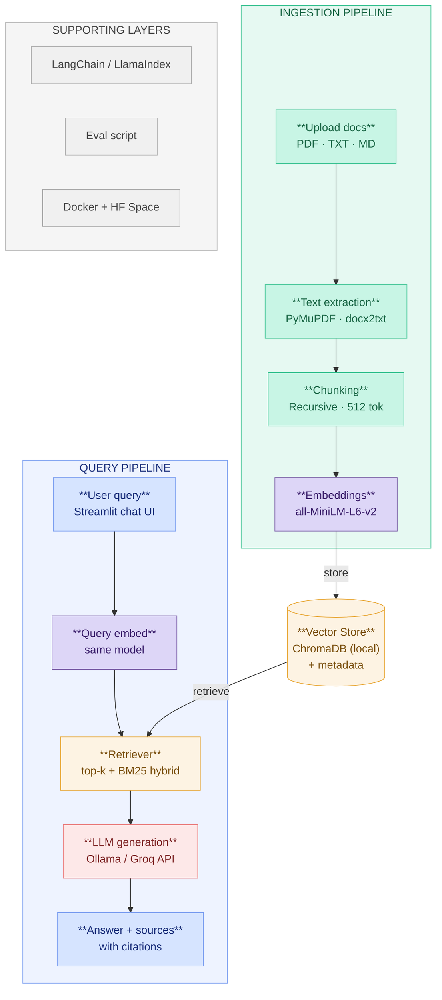

# 📄 RAG Document Q&A

A **Retrieval-Augmented Generation (RAG)** chatbot that lets you upload your own documents and ask questions about them in natural language. Built from scratch with a modular Python architecture — no black-box frameworks doing the heavy lifting.

---

## ✨ Features

- 📁 **Multi-format document ingestion** — PDFs (page-by-page via PyMuPDF), plain text (`.txt`), and Markdown (`.md`)
- 🧹 **Smart text cleaning** — heuristic header/footer stripping, corrupt file detection, minimum-length filtering
- ✂️ **Recursive chunking** — `RecursiveCharacterTextSplitter` with 2 048-char chunks and 200-char overlap to preserve context across boundaries
- 🔢 **Local embeddings** — `all-MiniLM-L6-v2` via `sentence-transformers`, wrapped in a thread-safe **Singleton** so the model loads exactly once
- 🗄️ **Persistent vector store** — [ChromaDB](https://www.trychroma.com/) with one collection per document; survives restarts
- 🔍 **Cross-collection similarity search** — queries fan out across all ingested documents and return the top-*k* most relevant chunks
- 🤖 **Dual LLM backend** — swap between a local [Ollama](https://ollama.com/) model (no internet, no cost) and the [Groq](https://groq.com/) API with a single env variable
- 🖥️ **Streamlit UI** — chat interface with a document sidebar
- 🧪 **Test suite** — pytest tests covering ingestion, embeddings, vectorstore, and retrieval
- 📊 **Evaluation harness** — RAGAS-based metrics runner

---

## 🏗️ Architecture



---

## 📂 Project Structure

```
rag-document-qna/
├── app/
│   ├── main.py                  # Application entrypoint
│   ├── rag/
│   │   ├── ingestion.py         # Document loading, cleaning & chunking
│   │   ├── embeddings.py        # Singleton SentenceTransformer wrapper
│   │   ├── vectorstore.py       # ChromaDB CRUD + similarity search
│   │   ├── retriever.py         # Retrieval logic
│   │   └── chain.py             # LangChain RAG chain assembly
│   ├── llm/
│   │   ├── ollama_llm.py        # Ollama LLM wrapper
│   │   └── groq_llm.py          # Groq API wrapper
│   └── ui/
│       ├── chat.py              # Streamlit chat interface
│       └── sidebar.py           # Document upload sidebar
│
├── tests/                       # pytest test suite
│   ├── test_ingestion.py
│   ├── test_embeddings.py
│   ├── test_retrieval.py
│   └── test_chain.py
│
├── eval/                        # RAG evaluation harness
│   ├── eval_runner.py
│   ├── metrics.py
│   └── test_questions.json
│
├── data/                        # Drop your documents here (git-ignored)
├── .env.example                 # Environment variable template
├── requirements.txt
├── Dockerfile
└── docker-compose.yml
```

---

## 🚀 Getting Started

### Prerequisites

- Python 3.10+
- (Optional) [Ollama](https://ollama.com/download) installed locally for the offline LLM backend
- (Optional) A [Groq API key](https://console.groq.com/) for the cloud LLM backend

### 1 — Clone & install

```bash
git clone https://github.com/<your-username>/rag-document-qna.git
cd rag-document-qna

python -m venv venv
source venv/bin/activate          # Windows: venv\Scripts\activate

pip install -r requirements.txt
```

### 2 — Configure environment

```bash
cp .env.example .env
```

Edit `.env` and fill in the values relevant to your chosen LLM backend:

```env
# Choose "ollama" for fully local inference or "groq" for the cloud API
LLM_PROVIDER=ollama

# Ollama settings (used when LLM_PROVIDER=ollama)
OLLAMA_MODEL=llama3.1:8b

# Groq settings (used when LLM_PROVIDER=groq)
GROQ_API_KEY=your_groq_key_here
GROQ_MODEL=llama-3.1-8b-instant

# Embedding & retrieval
EMBEDDING_MODEL=all-MiniLM-L6-v2
CHROMA_PERSIST_DIR=./chroma_db
CHUNK_SIZE=512
CHUNK_OVERLAP=50
TOP_K_RETRIEVAL=5
```

### 3 — (Ollama only) Pull the model

```bash
ollama pull llama3.1:8b
```

### 4 — Add documents

Drop any `.pdf`, `.txt`, or `.md` files into the `data/` folder.

### 5 — Run the app

```bash
streamlit run app/main.py
```

Open [http://localhost:8501](http://localhost:8501) in your browser.

---

## 🧪 Running Tests

```bash
pytest tests/ -v
```

Key test coverage:

| Test file | What it covers |
|-----------|---------------|
| `test_ingestion.py` | Document loading, corrupt file handling, chunking |
| `test_embeddings.py` | Singleton pattern, 384-dim output, batching, empty inputs |
| `test_retrieval.py` | End-to-end retrieval from ChromaDB |
| `test_chain.py` | RAG chain assembly and response generation |

---

## 🛠️ Tech Stack

| Layer | Technology |
|-------|-----------|
| Document parsing | [PyMuPDF](https://pymupdf.readthedocs.io/), LangChain loaders |
| Chunking | LangChain `RecursiveCharacterTextSplitter` |
| Embeddings | `sentence-transformers` — `all-MiniLM-L6-v2` (384-dim) |
| Vector store | [ChromaDB](https://www.trychroma.com/) (persistent) |
| LLM (local) | [Ollama](https://ollama.com/) |
| LLM (cloud) | [Groq](https://groq.com/) API |
| Orchestration | [LangChain](https://www.langchain.com/) |
| UI | [Streamlit](https://streamlit.io/) |
| Evaluation | [RAGAS](https://docs.ragas.io/) |
| Config | `python-dotenv`, `pydantic` |
| Logging | `loguru` |

---

## 🔑 Key Design Decisions

**Singleton EmbeddingModel** — The `SentenceTransformer` model is expensive to load. A double-checked locking singleton ensures it's initialised exactly once, even in a multi-threaded Streamlit environment.

**Per-document ChromaDB collections** — Each uploaded file gets its own collection (named after the file). This makes it trivial to delete, update, or inspect a single document's embeddings without touching the rest.

**No LangChain retriever lock-in** — The vectorstore layer is written directly against the ChromaDB client API rather than through a LangChain abstraction. This makes the retrieval logic transparent and easy to swap.

**Dual LLM backend via env var** — Switching between a fully local `ollama` run and the `groq` cloud API requires only changing `LLM_PROVIDER` in `.env` — no code changes.

---

## 📊 Evaluation

The `eval/` directory contains a RAGAS-powered harness for measuring retrieval and generation quality:

- `eval_runner.py` — orchestrates the evaluation pipeline
- `metrics.py` — defines the RAGAS metrics to compute (faithfulness, answer relevancy, context recall, etc.)
- `test_questions.json` — sample question/answer pairs for your documents

---

## 🗺️ Roadmap

- [ ] Complete LangChain RAG chain (`chain.py`)
- [ ] Finish Ollama and Groq LLM wrappers
- [ ] Build Streamlit chat + sidebar UI
- [ ] Hybrid retrieval (BM25 + dense embeddings via `rank_bm25`)
- [ ] Populate evaluation dataset and run RAGAS benchmarks
- [ ] Fill out Dockerfile and docker-compose for one-command deployment

---

## 📄 License

MIT
